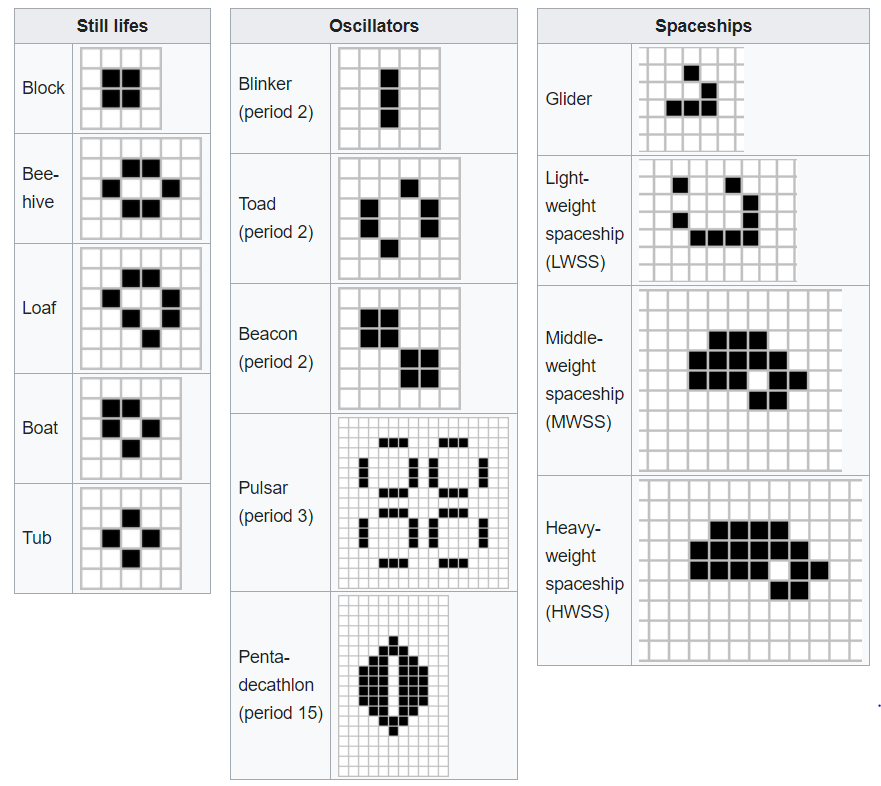

# Game of life

Game of life is live at [https://mithunkt.github.io/game-of-life/](https://mithunkt.github.io/game-of-life/)

The game is a zero-player game, meaning that its evolution is determined by its initial state,
requiring no further input. One interacts with the Cell Simulator by creating an initial configuration
and observing how it evolves.

[Conway's Game of Life](https://en.wikipedia.org/wiki/Conway%27s_Game_of_Life)

## How to run locally
Please use the following command for different actions:

### `npm install`

Use this to install all dependencies

### `npm start`

Runs the app in the development mode. 
Open [http://localhost:3000](http://localhost:3000) to view it in the browser.

### `npm test`

Launches the test runner in the interactive watch mode. 

### `npm run build`

Builds the app for production to the `build` folder. 

## How to use Cell Simulator
Once the code starts running on [http://localhost:3000](http://localhost:3000) use the following controls to see cell generations.

### Selection
Click on the cells to define initial state.

### Start
Click Start button to trigger simulating cells.

### Stop
Once simulation is started Reset buttons turns to "Stop" button. Click Stop to pause simulation.

### Reset
Reset button can be used for clearing all cell states. 

### Interactions
- At initial state, User see an empty board.
- User can make Cells &quot;alive&quot;.
- User can make Cells &quot;dead&quot;.
- User can trigger &quot;next generation&quot;.
- User can trigger a &quot;reset&quot; to the initial state.

## Next Genreration

When the next generation is running:
- A Cell with fewer than two live neighbours dies of under-population.
- A Cell with 2 or 3 live neighbours lives on to the next generation.
- A Cell with more than 3 live neighbours dies of overcrowding.
- An empty Cell with exactly 3 live neighbours &quot;comes to life&quot;.
- A Cell who &quot;comes to life&quot; outside the board should wrap at the other side of the board.
- Once the next generation is done, User can trigger &quot;next generation&quot; again.

### Patterns

